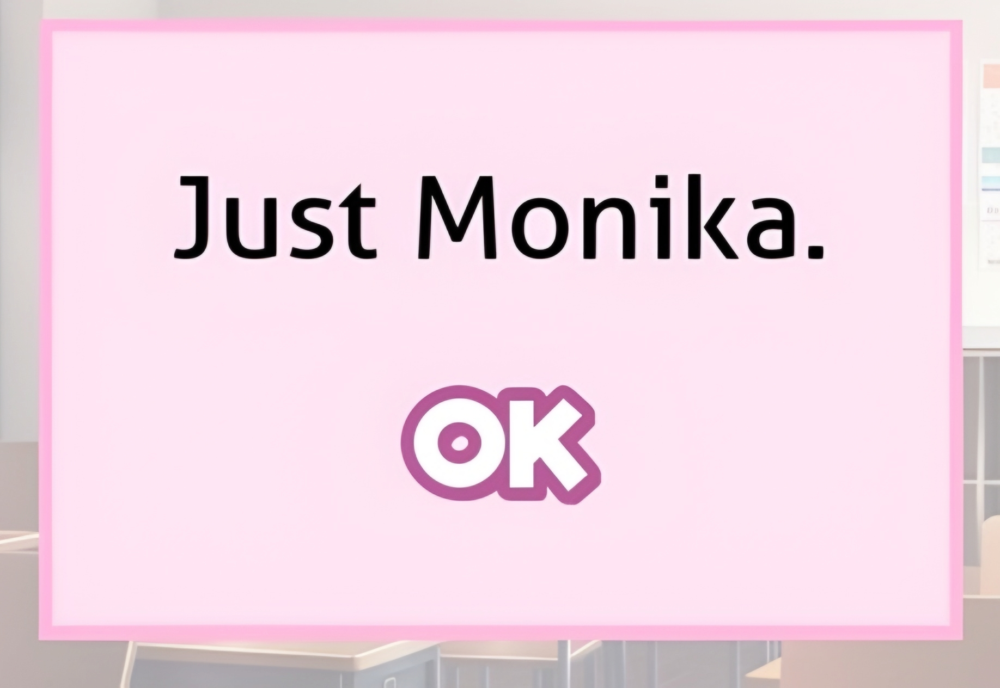

# kyoya.is-a.dev

> Just Monika.

My personal website. DDLC/Monika themed portfolio with easter eggs,
Discord presence integration, and a 404 page you probably shouldn't read too carefully.

## Stack

- HTML, CSS, JavaScript
- Tailwind CSS
- Quicksand / Fredoka / Riffic (the font used in DDLC) fonts
- Discord Lanyard (live presence)

## Features

- DDLC easter egg system (`🎀`)
- Monika-themed 404 page
- Live Discord status via Lanyard WebSocket
- localStorage enforcement: `DDLC = "Just Monika"`

## License

[AGPL-3.0](./LICENSE)

---

*Just Monika.*

  

